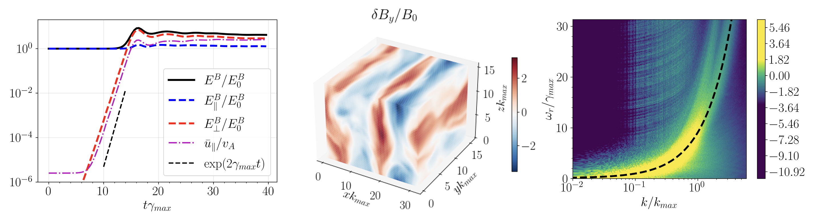
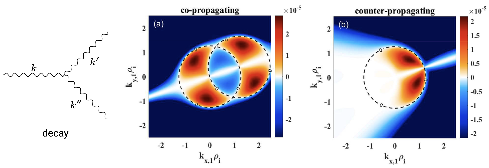

<!--
# Information 

- Contact: kxshen10@zju.edu.cn
- [Google Scholar](https://scholar.google.com/citations?user=PKmlMXkAAAAJ&hl=en)
- [ORCID](https://orcid.org/0000-0002-0512-6273)
-->

Email: kxshen10@zju.edu.cn

## Scientific Interests

1. mean-field theory, beam-plasma system, cosmic-ray streaming instability
2. wave turbulence, turbulence closure modeling, solar wind
3. coherent mode-coupling, parametric decay, modulation, soliton
4. collisionless shock, tokamak, space plasma, astrophysical plasma
5. analytical mechanics, statistical mechanics, classical field theory
6. nonlinear gyrokinetics, kinetic Alfven wave
7. numerical simulation (HPC)

My research interests lie in fundamental nonlinear plasma physics problems that can be treated by self-consistent theory and/or closure models, e.g., quasi-linear theory, field-theoretic (mean-field) approach, weak turbulence, dynamo, and eddy-damped quasi-normal Markovian (EDQNM) approximation. I have been working on space, astrophysical, and laboratory plasmas described by fluid, gyrokinetic, hybrid, or kinetic models. I am also interested in the applicability boundaries between different models/nonlinear theories. 

## Research Style

Here are several aspects I would look into when facing a physics problem:
- self-consistency: conservative properties, symmetries
- algebraic properties: quadratic invariants, Lie-Poisson brackets, Casimir invariants
- linear stability and equilibrium
- nonlinear dynamics and spectral evolution
- non-equilibrium process, statistical properties, and entropy production 

## Education
- Zhejiang University, Institute for Fusion Theory and Simulation, direct-to-PhD, 2023-2028
- INAF - Osservatorio Astrofisico di Arcetri, joint-PhD, 2025-2026
- Zhejiang University, School of Physics & CKC, BSc, 2019-2023

## Recent Work 1: Collisionless Shock, Cosmic-Ray-Driven Instability

- Saturation of Cosmic-Ray Non-Resonant Streaming Instability (NRSI, also known as the Bell's instability): 

- Effect of Parallel Mean Flow (PMF) on the Cosmic-Ray Non-Resonant Streaming Instability: The PMF as a mean-field is nonlinearly beat-driven by non-resonant fluctuations, and leads to the saturation of NRSI in the MHD regime and the frequency-chirping of fluctuations due to the Doppler-shift effect. A self-consistent mean-field theory is developed to compare quantitatively with simulations.

## Recent Work 2: Solar Wind, Kinetic-Alfvenic Turbulence

- Imbalanced Strong Kinetic-Alfvenic Turbulence

- Imbalanced Weak Kinetic-Alfvenic Turbulence

- Resonant Decay among Three Kinetic Alfven Waves (KAWs): The resonant parametric decay instability among three KAWs investigated using nonlinear gyrokinetic theory. A dual-type decay identified for waves co-propagating in the same direction. An inverse-type decay identified for the counter-propagating case. [K.Shen et al. 2024 PoP]

## Other Works: 
- Nonlinear Ion Compton Scattering of Toroidal Alfven Eigenmodes (TAEs) [Z.Cheng et al. 2024 NF] in MCF and its Spectral Cascading [Z.Cheng et al. 2025 NF]
