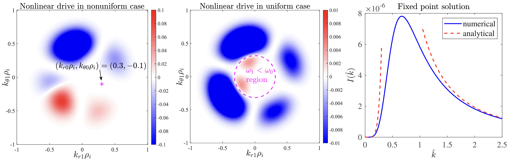

## Recent Work 1: Collisionless Shock, Cosmic-Ray-Driven Instability
<!--
- Non-Perturbative Treatment of Particle Acceleration in Collisionless Shocks

- Mean-Field Theory for the Saturation of Cosmic-Ray Streaming Instability: 

- Cosmic-Ray Streaming Instability - a Beam-Plasma Perspective:

- Saturation of Cosmic-Ray Non-Resonant Streaming Instability (NRSI, also known as the Bell's instability):

- Nonlinear Landau Damping in Cosmic-Ray Streaming Instability:

- Saturation of Oblique Non-Resonant Streaming Instability due to Wave-Mean-Field Interaction in the MHD Regime: 
-->
- Effect of *Parallel Mean Flow* (PMF) on the Cosmic-Ray Non-Resonant Streaming Instability: The PMF as a mean-field is nonlinearly beat-driven by non-resonant fluctuations, and leads to the saturation of NRSI in the MHD regime and the frequency-chirping of fluctuations due to the Doppler-shift effect. A self-consistent *mean-field theory* is developed to compare quantitatively with simulations.

## Recent Work 2: Solar Wind, Kinetic-Alfvenic Turbulence
<!--
- Imbalanced Strong Kinetic-Alfvenic Turbulence - EDQNM

- Imbalanced Weak Kinetic-Alfvenic Turbulence - WTT (QNM)
-->
- Resonant Decay among Three Kinetic Alfven Waves (KAWs): The resonant parametric decay instability among three KAWs investigated using nonlinear gyrokinetic theory. A *dual-type decay* identified for waves co-propagating in the same direction. An inverse-type decay identified for the counter-propagating case. [K.Shen et al. 2024 PoP]

## Other Works: Tokamak Plasma
- Nonlinear Ion Compton Scattering of Toroidal Alfven Eigenmodes (TAEs) [Z.Cheng et al. 2024 NF] in MCF and its Spectral Cascading [Z.Cheng et al. 2025 NF]

